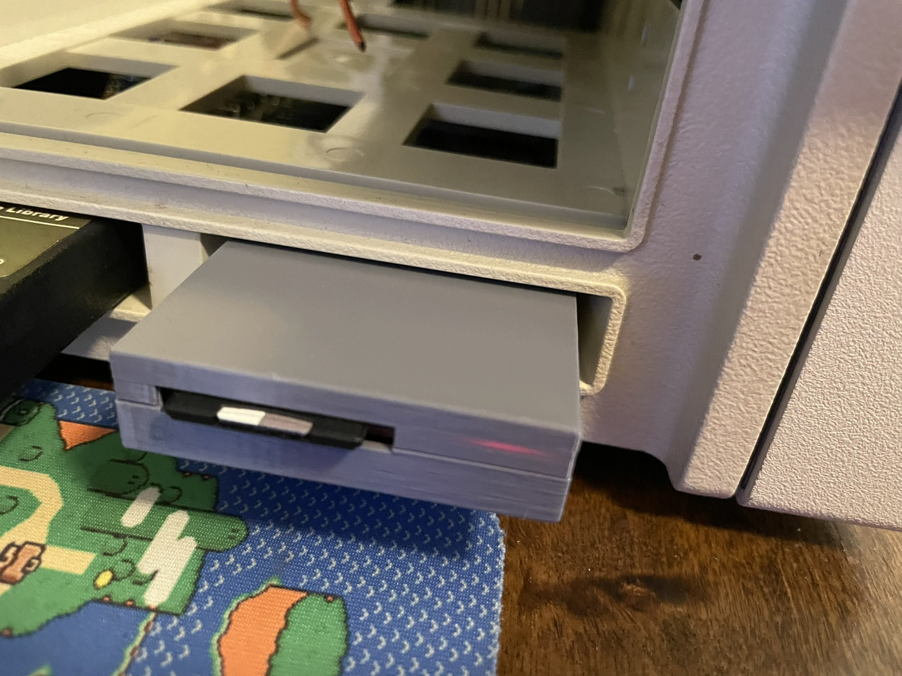
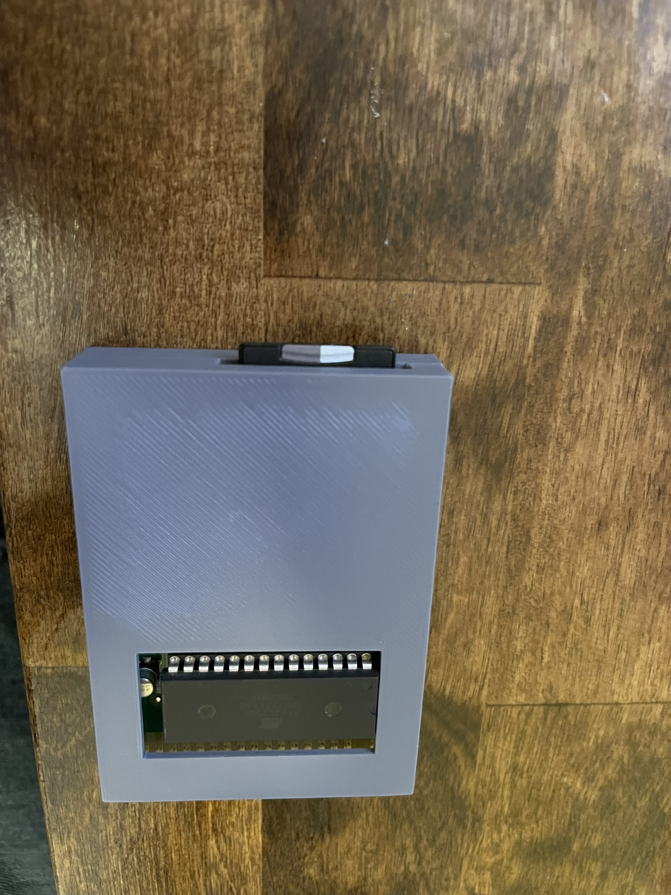
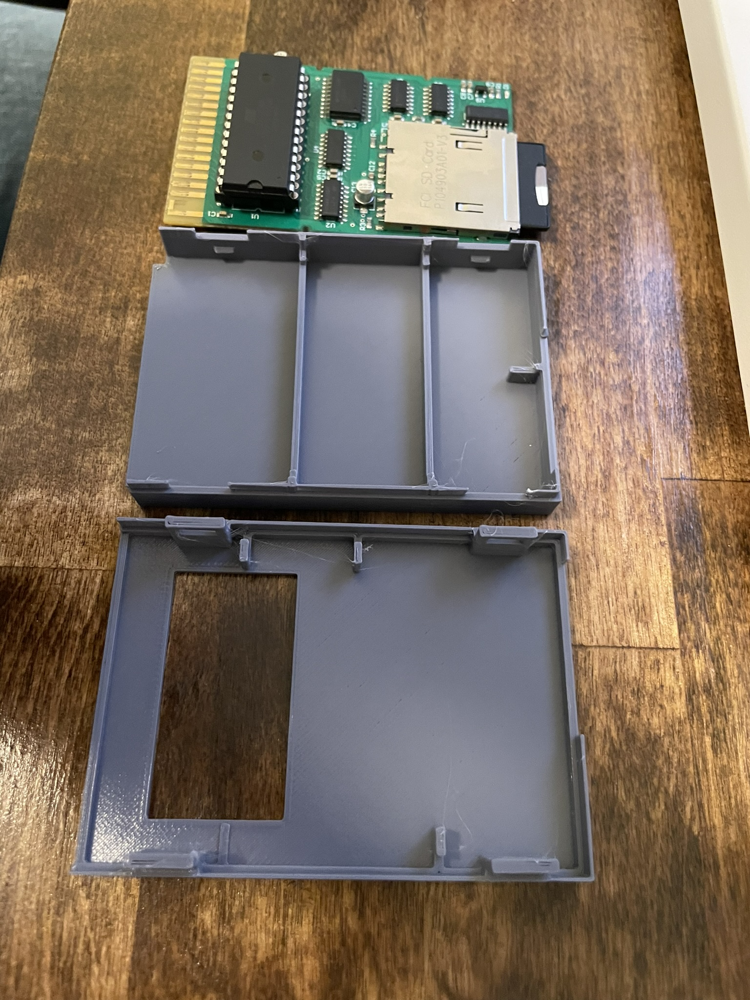
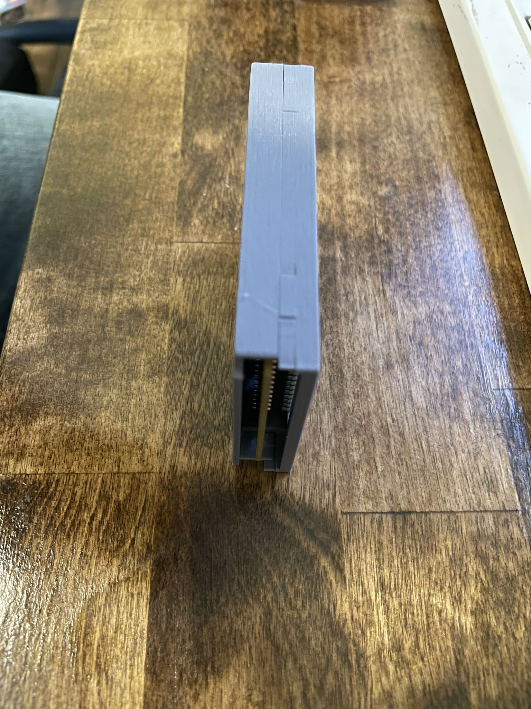
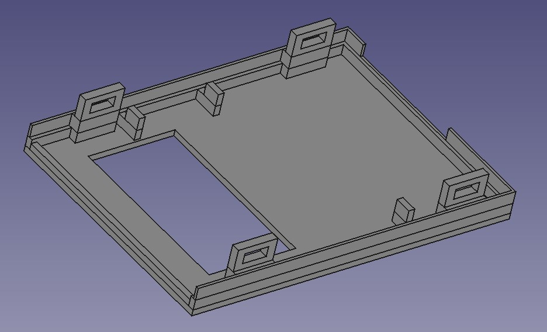
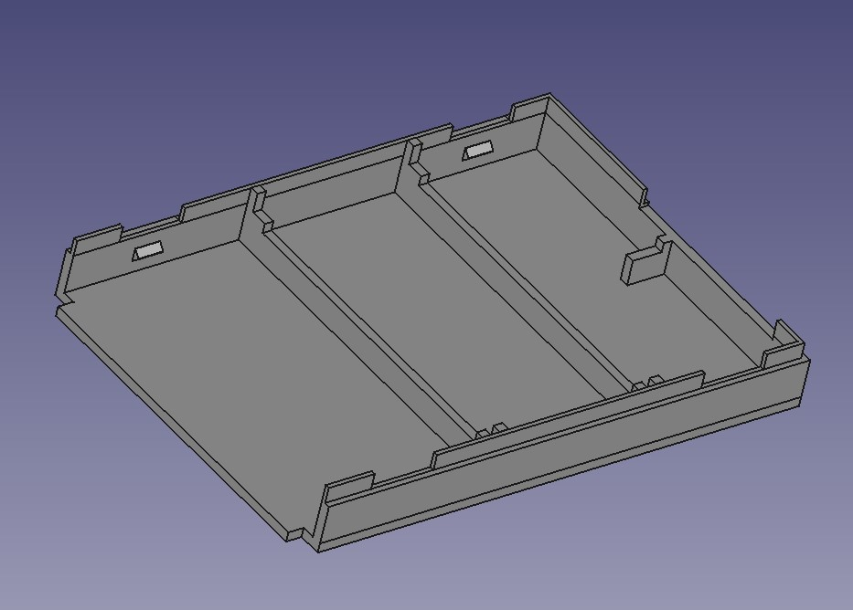

# SD-Cart-JR-homebrew-printable-case
This is a homebrew 3d-printed case for the SD-Cart JR with clearance for the socketed boot ROM option. Designed primarily to prevent the SD-Cart JR from flexing in the cartridge socket while inserting/removing SD cards while in use.

This print was designed to be toolless and not require any screws. However, as a trade-off that means the latches are pretty brittle and easily snapped. Don't expect it to survive more than one or two re-openings before the latches break. Do expect to break it and need to re-print another one if you need to re-open it for some reason.

Project Contains:

1.) FreeCAD project files (for editing/modification)
2.) Exported STL files

Settings as printed:
Prusa i3 Mk3
0.2mm Quality, PLA, 15% infill

Note 1: When attempting to close it, be slow and deliberate, while watching to ensure the thin edges are lining up and gently maniuplating them if they're not. If you force it, it can either mis-align or snap one of the latches.

Note 2: The design does not have a hole for the LED (whoops) but you can somewhat see it through the case.

Note 3: The design does not have the holes for un-latching (whoops). It is possible to re-open it by pulling it apart, but as noted above the latches are brittle.

Note 4: The design has a hole in the top to have clearance for the boot ROM (which when socketed sticks out of the top a bit), since there is very little clearance between the SD-Cart JR and the PCjr cartridge slot already.

